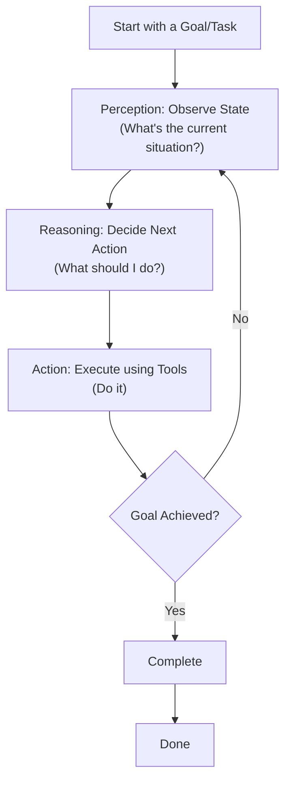
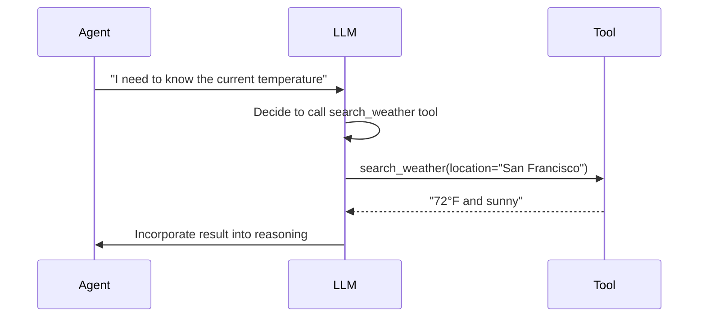

# AI Agents: Fundamentals

## What is an AI Agent?

An AI agent is a software system that can perceive its environment, reason about it, and take autonomous actions to achieve specific goals. Unlike static applications that respond only to direct user input, agents can operate independently, make decisions, and learn from their interactions.

**Core distinction:** A traditional program executes a fixed sequence of instructions. An agent observes the world, decides what to do next, and repeats until its goal is achieved.

### Simple Definition
An AI agent = **Perception → Reasoning → Action** in a loop

## Key Components

### 1. Perception (Observation)
The agent gathers information about its current state:
- User input or queries
- Environmental data (sensor readings, file contents, API responses)
- Internal state (memory, past decisions)
- Tool outputs (results from actions taken)

### 2. Reasoning (Decision-Making)
The agent processes information and determines what to do:
- Uses an LLM to understand the current situation
- Decides which action to take next
- Can plan multiple steps ahead
- May reason about constraints and goals

### 3. Action (Execution)
The agent affects the world:
- Calls tools or APIs
- Modifies files or databases
- Asks follow-up questions
- Generates responses or artifacts

## The Agentic Loop

The fundamental pattern is cyclic:

The agent repeats this loop until it either:
- Successfully completes the goal
- Determines the goal is impossible
- Runs out of iterations/tokens
- Encounters an unrecoverable error

## Core Characteristics

### Autonomy
Agents operate without constant human direction. They decide what to do next based on their reasoning, not explicit programmed instructions.

### Reactivity
Agents respond to changes in their environment. If new information arrives, they can adjust their plan.

### Proactivity
Agents work toward goals, not just react to queries. They can make multi-step plans.

### Adaptability
Agents can handle novel situations because they reason about them rather than follow hard-coded rules.

## Tools: The Agent's Hands

An agent without tools can only think—it can't act in the world. Tools give agents the ability to:
- Read files or query databases
- Call APIs and external services
- Run code
- Search the internet
- Modify documents

**Tool calling pattern:** The LLM decides which tool to use, the runtime executes it, and the result comes back to the agent for further reasoning.

### Example Tool Calls

## A Concrete Example: Research Agent

Imagine an agent tasked with "Find information about AI safety concerns."

1. **Perception:** Understand the task—what does "AI safety" mean? What counts as a "concern"?
2. **Reasoning:** Decide to search the web and read articles. Identify which sources are credible.
3. **Action:** Use search tools, fetch web pages, extract key points.
4. **Loop:** Read results, decide if more sources are needed, search again if necessary.
5. **Completion:** Synthesize findings into a report.

Throughout this loop, the agent makes judgments:
- Are these results relevant?
- Do I have enough information?
- What should I search for next?
- Which claims are supported by evidence?

## Agent vs. Chatbot

| Aspect | Chatbot | Agent |
|--------|---------|-------|
| **Interaction** | Responds to each message independently | Maintains context across multiple steps |
| **Goal** | Provide helpful responses | Complete specific tasks |
| **Planning** | No multi-step planning | Plans and executes sequences of actions |
| **Tools** | Generally no tool use | Uses tools as part of task execution |
| **Autonomy** | Waits for user direction | Operates independently toward goals |
| **Example** | ChatGPT answering a question | An agent booking a flight, filing documents, debugging code |

## Types of Agents

### Reactive Agents
Respond directly to input without internal state or planning.
- Fast and simple
- Limited to immediate tasks
- Example: A chatbot answering FAQs

### Deliberative Agents  
Maintain internal models and plan multi-step solutions.
- Can handle complex tasks
- Better at novel situations
- Requires more computation

### Hierarchical Agents
Coordinate multiple agents or sub-tasks.
- Distribute work across teams of agents
- Each agent specializes in different areas
- Enables large-scale task completion

### Learning Agents
Improve over time by learning from successes and failures.
- Better performance with experience
- Can adapt to changing environments
- More complex to build and train

## Why Agents Matter

Traditional software requires explicit instructions for every scenario. Agents can reason through novel situations because they leverage LLM capabilities:

1. **Flexibility** – Handle tasks they weren't specifically programmed for
2. **Scalability** – Extend tool access without rewriting logic
3. **Human-like reasoning** – Make decisions similar to how humans would
4. **Reduced maintenance** – Less hard-coded logic to maintain
5. **Composability** – Multiple agents can work together on complex problems

## Limitations and Challenges

Agents aren't magical—they have real constraints:

- **Reasoning quality** – Only as good as the underlying LLM
- **Token limits** – Can't reason about unlimited context
- **Tool reliability** – Depends on tool correctness and availability
- **Cost** – LLM calls can be expensive for complex reasoning
- **Predictability** – Harder to guarantee consistent behavior
- **Hallucinations** – LLMs can confabulate or make errors
- **Safety** – Autonomous action requires careful guardrails

## Key Takeaway

An AI agent is a system that **perceives → reasons → acts** in a loop to achieve goals. The power comes from combining an LLM's reasoning with tool access, allowing autonomous problem-solving in complex environments.

The remaining concepts in this learning path build on this foundation:
- How to structure loops for reliability (next doc)
- How to design effective tools
- How to coordinate multiple agents
- How to add safety and control mechanisms

---

**Next:** [Agentic Loops: Building Reliable Autonomous Systems](agentic-loops.md)
