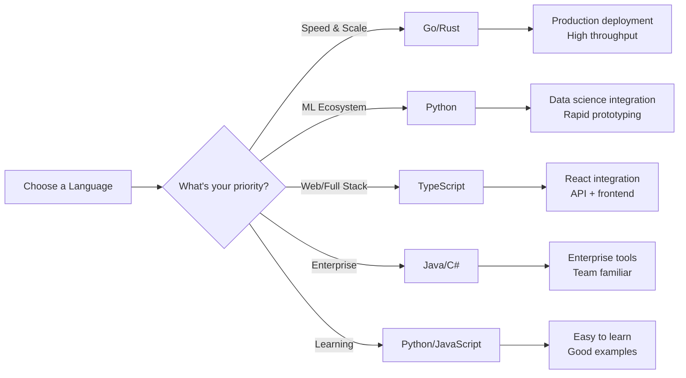
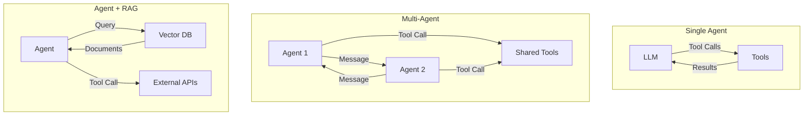
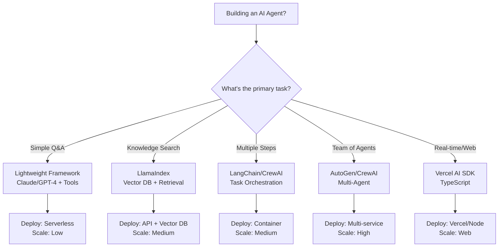

# Tools, Frameworks, and Languages for Building AI Agents

This document surveys the landscape of technologies available for building AI agents. It covers LLM providers, frameworks, programming languages, and supporting tools.

## LLM Providers

The LLM is the reasoning engine of any agent. Here are the major providers:

### Closed-Source Models
- **OpenAI** – GPT-4, GPT-4 Turbo, GPT-3.5-Turbo. Best-in-class reasoning and tool use. High cost for complex tasks.
- **Anthropic** – Claude (Opus, Sonnet, Haiku). Strong reasoning and safety features. Supports extended context windows.
- **Google** – Gemini Pro, Ultra. Integrated with Google Cloud. Good for multimodal tasks.
- **Mistral AI** – Mistral Large, Medium, Small. European-focused, open weights options.

### Open-Source Models
- **Meta Llama** – Llama 2/3. Permissive licensing, can run locally. Smaller context windows.
- **Hugging Face** – Hosting and tools for open models. Access to thousands of models.
- **Ollama** – Run open-source models locally with simple CLI. Great for development and privacy.

### Considerations
- **Cost:** Closed-source APIs pay per token. Open-source can be self-hosted (infrastructure cost instead).
- **Latency:** Local models are faster but less capable. API calls have network overhead.
- **Context Window:** Larger windows support longer reasoning and more tool history. Costs more.
- **Tool Use Quality:** Different models have different tool-calling accuracy. Test with your use case.
- **Safety/Compliance:** Some tasks require on-premise or specific model families.

## Agent Frameworks

Frameworks provide abstractions for building agent loops, managing state, and coordinating tools.

### Python Frameworks

#### LangChain
- Mature ecosystem for building LLM applications
- Agent abstractions, tool management, memory, document loaders
- Large community and extensive documentation
- Trade-off: Heavy abstraction layer, sometimes feels over-engineered for simple tasks

#### LlamaIndex
- Specialized for data indexing and retrieval (RAG patterns)
- Agent support, query engines
- Good for document-heavy applications
- Trade-off: Less suitable for pure agentic workflows without retrieval

#### AutoGen (Microsoft)
- Multi-agent orchestration framework
- Agent conversation patterns, agent groups
- Good for teams of cooperating agents
- Trade-off: More opinionated about agent patterns

#### CrewAI
- Simplified multi-agent framework
- Task-agent assignment, role-based agents
- Easier mental model than AutoGen
- Trade-off: Newer, smaller community

#### Pydantic AI
- Lightweight, type-safe agent framework
- Built on Pydantic for structured outputs
- Minimal dependencies
- Great for building custom agent loops

#### TaskWeaver (Microsoft)
- Orchestrates multiple AI agents with code execution
- Agent-to-agent communication
- Code interpreter for tool execution
- Trade-off: Newer, less community support

### TypeScript/JavaScript Frameworks

#### Vercel AI SDK
- Lightweight, React-friendly
- Built for streaming and frontend integration
- Tool calling support
- Trade-off: Less mature than Python options

#### LangChain JS
- JavaScript port of LangChain
- Smaller feature set than Python version
- Good for Node.js backends

#### AgentKit
- Minimal, composable agent framework
- Focus on simplicity and flexibility
- Good for building custom agents

### Considerations
- **Abstraction Level:** High-level frameworks hide complexity but reduce flexibility. Low-level gives control but more work.
- **Community:** Larger communities mean more examples, solutions, and third-party integrations.
- **Dependencies:** Lightweight frameworks are easier to understand and modify. Heavy frameworks provide more features out-of-box.
- **Type Safety:** TypeScript/Pydantic frameworks help catch errors at development time.

## Programming Languages

### Python
- **Pros:** Largest LLM ecosystem, mature frameworks, easy to learn, great for prototyping
- **Cons:** Slower execution, harder to deploy at scale
- **Best for:** Research, prototyping, data-heavy agents
- **Popular Frameworks:** LangChain, LlamaIndex, CrewAI, Pydantic AI

### TypeScript/JavaScript
- **Pros:** Frontend integration, single language across stack, Node.js ecosystem
- **Cons:** Smaller LLM ecosystem, fewer mature frameworks
- **Best for:** Web-based agents, full-stack applications
- **Popular Frameworks:** Vercel AI SDK, LangChain JS, AgentKit

### Go
- **Pros:** Fast compilation, excellent for concurrent tasks, good standard library
- **Cons:** Smaller LLM ecosystem, steeper learning curve
- **Best for:** High-performance agent services, microservices
- **Popular Frameworks:** Custom implementations common

### Rust
- **Pros:** Extreme performance, memory safety, excellent for systems code
- **Cons:** Complex language, still building LLM ecosystem
- **Best for:** Production agents at scale, security-critical applications

### Java / C#
- **Pros:** Enterprise tooling, strong type systems, mature deployment patterns
- **Cons:** Verbose, steeper learning curve
- **Best for:** Enterprise applications, teams with existing Java/C# expertise

## Supporting Tools

### Code Execution & Sandboxing
- **E2B** – Secure cloud sandboxes for code execution
- **Replit** – Run code in the browser
- **Docker** – Local containerization for reproducible execution
- **Google Cloud Run** – Serverless code execution

### Vector Databases (for RAG)
- **Pinecone** – Managed vector search
- **Weaviate** – Open-source vector database
- **Milvus** – Scalable vector search
- **Postgres + pgvector** – Vector search in SQL

### Monitoring & Observability
- **Langsmith** – Debug and trace LangChain/LlamaIndex applications
- **Arize** – LLM monitoring and evaluation
- **Datadog** – General application monitoring
- **Custom logging** – Simple approach for simple agents

### Evaluation & Testing
- **RAGAS** – Evaluate RAG systems
- **DeepEval** – LLM-based evaluation framework
- **Pytest** – Standard Python testing
- **Manual testing** – Often necessary for agentic behavior

## Architecture Patterns

- **Single Agent:** LLM + Tools in a loop. Simplest, best for single-task workflows.
- **Multi-Agent:** Agents communicate and coordinate. Better for complex, multi-step tasks.
- **Agent + RAG:** Retrieval-augmented generation for knowledge-grounded agents. Essential for custom knowledge bases.
- **Agent + Code Execution:** Agent can write and execute code. Powerful for problem-solving, requires sandboxing.

## Decision Framework

## Getting Started Recommendations

### For Learning
- **Language:** Python
- **LLM:** Claude (Anthropic) or GPT-4 (OpenAI)
- **Framework:** Pydantic AI (lightweight) or LangChain (ecosystem)
- **Approach:** Start with a single agent, add tools, then experiment with loops

### For Production
- **Language:** Depends on team expertise (Python for ML, TypeScript for web, Go for scale)
- **LLM:** Multiple providers for redundancy (Claude + OpenAI)
- **Framework:** Choose based on complexity (lightweight for simple, heavier frameworks for orchestration)
- **Infrastructure:** Cloud provider with managed databases and compute

### For Rapid Prototyping
- **Language:** Python
- **LLM:** OpenAI (most examples use it)
- **Framework:** LangChain (largest community)
- **Hosting:** Local development + cloud deployment

## Key Takeaway

There's no "best" choice—it depends on your constraints:
- **Learning:** Pick Python + Claude for simplicity
- **Team:** Pick languages your team knows
- **Scale:** Python for quick wins, Go/Rust for high-performance
- **Integration:** JavaScript for web, Python for data science
- **Complexity:** Start lightweight (Pydantic AI), graduate to heavier frameworks as needs grow

---

**Next:** Return to [Agentic Loops: Building Reliable Autonomous Systems](02-agentic-loops.md) for implementation patterns
