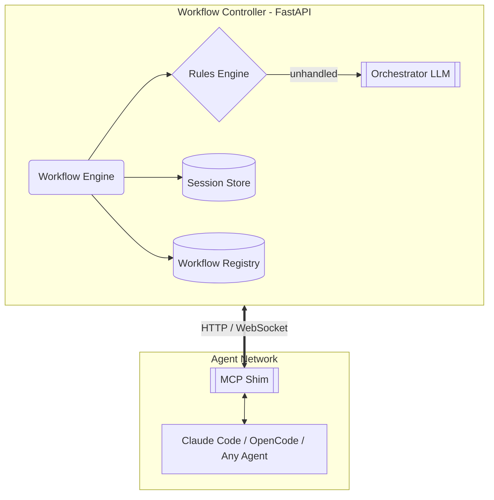
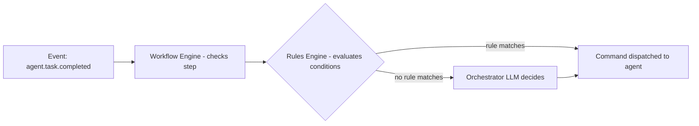

# Workflow Controller

An **agent-agnostic workflow controller** for orchestrating multiple AI agents. Agents (Claude Code, OpenCode, custom LangChain agents, etc.) connect to the controller via a language-agnostic protocol. The controller manages the workflow — assigning tasks, enforcing rules, routing between agents, and escalating to an orchestrator LLM or human when needed.



## Design Decisions

| Decision | Choice | Why |
|----------|--------|-----|
| **Purpose** | Multi-agent orchestration | Coordinate work across agents — sequential, parallel, supervisor patterns |
| **Protocol** | Language-agnostic (HTTP REST + WebSocket) | Any agent in any language can connect. JSON over HTTP/WS — no SDK lock-in |
| **Decision engine** | Hybrid (rules + LLM) | Rules for deterministic safety/constraints, LLM for flexible orchestration decisions |
| **Server role** | Standalone orchestrator | Coordinates agents, makes orchestration LLM calls, but does not execute tasks itself |
| **Agent integration** | MCP tools (primary) + hooks (investigation) | MCP works with Claude Code, OpenCode, Cline today. Pre-execution hooks are evolving — we track both |
| **Repository** | Subdirectory of loopai | Keeps docs, examples, and experiments in one place with cross-references |

## Repository Layout

```
workflow-controller/
├── README.md                   ← This file
├── protocol/                   ← Protocol specification (OpenAPI)
│   ├── openapi.yaml            ← Formal API contract
│   └── spec.md                 ← Human-readable protocol docs
├── server/                     ← Python FastAPI implementation
│   ├── main.py                 ← FastAPI app, routes, WS handlers
│   ├── workflow_engine.py      ← YAML workflow loader + step executor
│   ├── rules_engine.py         ← Declarative rule evaluator
│   ├── orchestrator.py         ← LLM decision layer
│   ├── agent_manager.py        ← Registry of connected agents
│   ├── session_store.py        ← Per-workflow-run state
│   ├── models.py               ← Pydantic schemas
│   ├── config.py               ← Settings
│   ├── workflows/              ← Built-in example workflows
│   │   ├── sequential.yaml
│   │   ├── supervisor.yaml
│   │   └── parallel-review.yaml
│   └── requirements.txt
├── shim/                       ← Agent-side integrations
│   ├── mcp-shim/               ← Generic MCP server (Claude Code, OpenCode, etc.)
│   │   ├── pyproject.toml
│   │   └── mcp_shim.py
│   └── controlled-agent/       ← Reference Python agent (LangChain)
│       ├── controlled_agent.py
│       └── example_usage.py
├── examples/                   ← Runnable example scripts
│   ├── 01_sequential_coder_reviewer.py
│   ├── 02_supervisor_agent.py
│   └── 03_claude_code_integration.md
└── docs/                       ← Usage and architecture docs
    ├── architecture.md
    ├── getting-started.md
    ├── writing-workflows.md
    └── supported-agents.md
```

## Protocol Overview

The protocol is the foundation — language-agnostic, JSON over HTTP/WebSocket.

### Agent → Controller (`POST /events`)

| Event | Payload | Purpose |
|-------|---------|---------|
| `agent.register` | `{agent_id, capabilities, tools}` | Agent announces itself |
| `agent.status` | `{status: "busy"|"idle"|"error"}` | Heartbeat / state update |
| `agent.task.completed` | `{task_id, result}` | Finished assigned work |
| `agent.task.failed` | `{task_id, error}` | Hit an error |
| `agent.tool.called` | `{tool, params, result}` | Observability |
| `agent.inquire` | `{question}` | Agent asks for guidance |

### Controller → Agent (callback or WS push)

| Command | Payload | Purpose |
|---------|---------|---------|
| `agent.assign` | `{task_id, prompt, context, workflow_id, step_id}` | Assign a task |
| `agent.cancel` | `{reason}` | Abort current work |
| `agent.instruct` | `{instruction}` | Inject mid-task guidance |
| `agent.query` | `{fields}` | Request status |

## Workflow Definitions (YAML)

Workflows are defined as YAML files. A workflow is a series of steps, each assigned to an agent. Rules determine what happens when a step completes.

```yaml
name: sequential-code-review
version: "1.0"
description: "Coder generates code, reviewer checks it, loop until approved"

steps:
  - id: implement
    assign_to: coder-agent
    prompt: "Implement {{ task.description }} in {{ task.language }}"
    tools: ["edit", "read", "bash"]
    on_complete: review

  - id: review
    assign_to: reviewer-agent
    prompt: |
      Review this implementation:
      {{ steps.implement.result }}
      Check for: bugs, security, style, edge cases
    tools: ["read"]
    rules:
      - if: "result.severity == 'critical'"
        action: "reassign to coder-agent with feedback"
        feedback: "{{ result.issues }}"
        step_id: implement
      - if: "result.severity == 'minor'"
        action: "reassign to coder-agent with feedback"
        feedback: "{{ result.issues }}"
        step_id: implement
      - else:
        action: "complete"
        output: "{{ steps.implement.result }}"

max_iterations: 3
```

### Decision Flow



## Agent Integration

### MCP Shim (for Claude Code, OpenCode, Cline, etc.)

A single MCP server exposes tools any MCP-compatible agent can call. The shim runs as a local sidecar process.

**MCP tools exposed:**

| MCP Tool | Purpose |
|----------|---------|
| `workflow_get_task()` | Poll controller for next assignment |
| `workflow_complete(result)` | Report task done |
| `workflow_fail(error)` | Report failure |
| `workflow_inquire(question)` | Ask controller for guidance |
| `controller_status()` | Health check |

**CLAUDE.md instruction set:**

```markdown
# Workflow Controller

You are managed by an external workflow controller.
- Before starting any work, call `workflow_get_task()` to receive your assignment
- Do not proceed beyond what was assigned
- When done, call `workflow_complete(result)`
- If stuck, call `workflow_inquire(question)` before proceeding
```

OpenCode uses the same MCP server, configured in `opencode.json` under `mcpServers`, with equivalent instructions in `AGENTS.md`.

### Controlled Agent (Python / LangChain)

A reference implementation of an agent that natively implements the protocol. This is the pattern for building custom agents that speak directly to the controller without an MCP bridge.

```python
agent = ControlledAgent(
    controller_url="http://localhost:8000",
    agent_id="my-custom-agent",
    capabilities=["python", "code-generation", "testing"],
    llm=ModelClaudeHaiku45(),
    tools=[my_tool1, my_tool2]
)
await agent.run()
```

The agent loop calls the controller at every step: register → await assignment → execute LLM + tool cycle → report completion → await next assignment.

### Pre-Execution Hooks (Investigation Track)

Claude Code's evolving `--approval-mode` and pre-execution hook APIs may provide lower-level integration. We track this separately and document findings in `docs/claude-code-integration.md`. The MCP approach works today.

## Phased Implementation

### Phase 1 — Protocol Definition
- `protocol/openapi.yaml` — Full OpenAPI 3.1 spec
- `protocol/spec.md` — Human-readable protocol docs
- **Output:** A formal contract that any agent implementation can target

### Phase 2 — Server
- FastAPI app with all routes and WebSocket handlers
- Workflow engine (YAML loader + step executor)
- Rules engine (declarative `if/then/else` evaluator)
- Orchestrator LLM (using existing `examples/models.py` pattern — Claude Haiku 4.5 via OpenCode Zen)
- Session store (SQLite, with path to Postgres)
- **Output:** A runnable server with example workflows

### Phase 3 — MCP Shim
- Single Python MCP server package
- Exposes the 5 workflow tools
- Works with Claude Code, OpenCode, Cline
- **Output:** `pip install`-able shim that connects any MCP agent to the controller

### Phase 4 — Controlled Agent (Reference)
- LangChain-based agent that natively speaks the protocol
- Demonstrates the integration pattern for custom agents
- **Output:** Reference implementation + example script

### Phase 5 — Documentation & Examples
- Architecture guide, getting-started tutorial, workflow authoring guide
- Runnable examples: sequential, supervisor, parallel-review
- Claude Code integration walkthrough
- **Output:** Complete docs + 3+ runnable demos

## Dependencies

| Component | Dependencies |
|-----------|-------------|
| **Server** | `fastapi`, `uvicorn`, `pyyaml`, `httpx`, `pydantic`, `sqlite-utils` |
| **Orchestrator LLM** | `langchain-anthropic` (via shared `examples/models.py`) |
| **MCP Shim** | `mcp` (official Python SDK) |
| **Protocol** | None — just JSON over HTTP/WS |

No hard lock-in. Every component is replaceable since the protocol is the contract.

## Risks & Mitigations

| Risk | Mitigation |
|------|-----------|
| Claude Code MCP adoption is clunky | MCP support is improving; fallback to CLI-based polling if needed |
| Agents go rogue (ignore controller) | CLAUDE.md instructions + investigate enforcement hooks |
| Workflow YAML grows too complex | Keep rules simple; route complexity to orchestrator LLM |
| State management gets complicated | SQLite for single-server; document Postgres migration path |

## Next Steps

1. Write the OpenAPI protocol spec (`protocol/openapi.yaml`)
2. Build the server skeleton with event ingestion and WebSocket support
3. Implement the workflow engine with YAML loading
4. Build the MCP shim
5. Write examples and documentation
